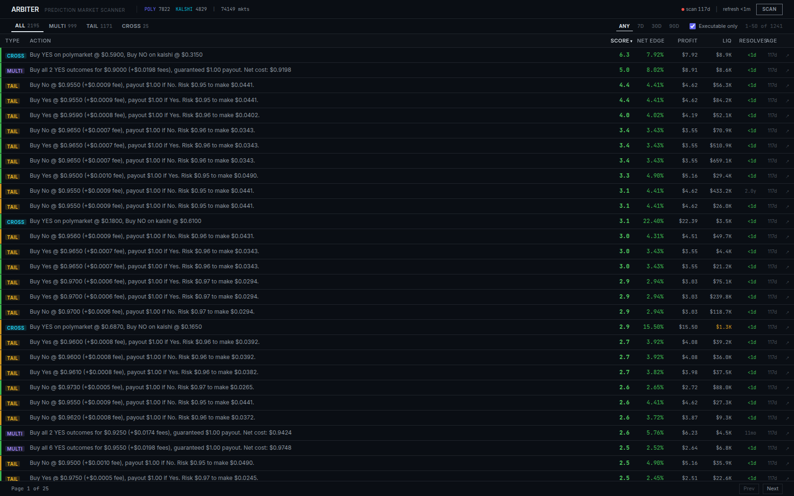

# Arbiter

Prediction-market opportunity scanner. Collects events and markets from Polymarket and Kalshi on a schedule, matches the same real-world events across the two exchanges, and surfaces three kinds of opportunities: multi-outcome arbs (an event whose YES prices don't sum to 1.00), tailing plays (near-certain outcomes above 95% with remaining edge), and cross-exchange arbs (the same event priced differently on each exchange). Every opportunity is fee-adjusted using each exchange's actual fee model and tagged with a quality tier (high, medium, low, theoretical) based on edge and liquidity, so untradeable results — missing outcomes, positions that require shorting, too many legs, thin books — are labeled instead of hidden.

## Architecture

A FastAPI backend runs a scan cycle every few minutes (APScheduler, interval configurable via `COLLECTION_INTERVAL_MINUTES`): pull events from the Polymarket Gamma API and the Kalshi Events API, run the multi-outcome and tailing analyzers, match events across exchanges with Jaccard similarity on titles, detect cross-exchange arbs, and prune price snapshots older than 48 hours. Results land in SQLite and are served over a REST API. The React frontend is a dense table view with filters, sorting, and a split-view detail panel — built as a desktop monitoring tool, not a consumer app. Both exchanges allow unauthenticated reads, so no API keys are needed.

## Stack

- Backend: Python 3.12, FastAPI, SQLAlchemy (async) + SQLite, httpx, APScheduler
- Frontend: React 19, TypeScript, Vite, Tailwind CSS v4
- Deployment: Docker Compose

## Running

```bash
docker compose up -d --build
```

- Frontend: http://localhost:8889
- Backend API: http://localhost:8890/api

For development, the backend runs with uvicorn from `backend/` (`uvicorn arbiter.main:app --port 8888`) and the frontend with `npm run dev` from `frontend/`.

## Screenshots


